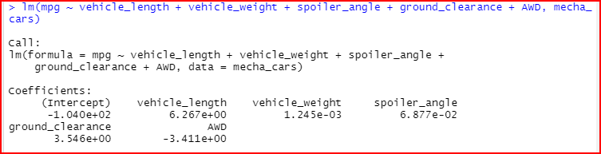
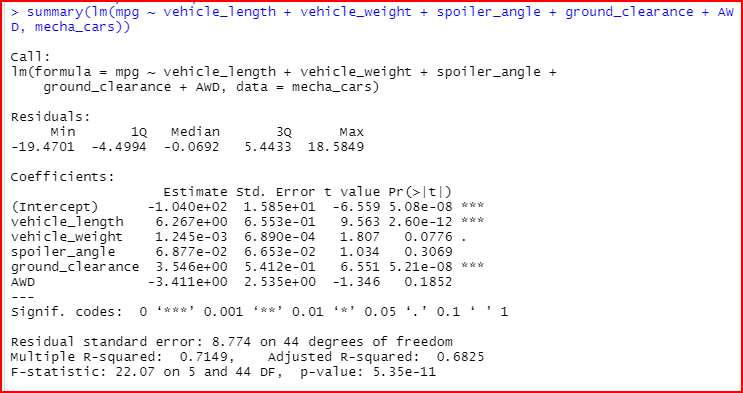
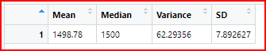
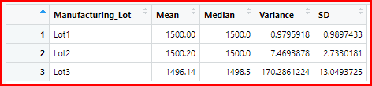
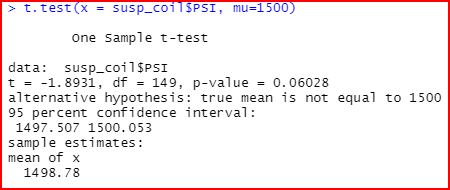
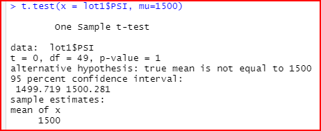
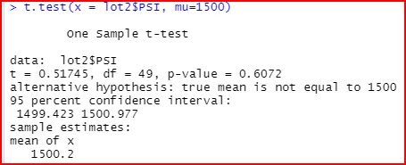
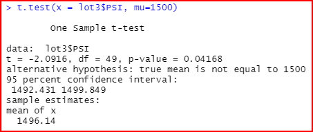

# MechaCar_Statistical_Analysis

Upper management for the company AUtosRUs has presented an opportunity to join a special project for their newest prototype, the MechaCar. The production of this vehicle has encountered a number of different issues which are blocking the manufacturing team's progress. AutosRUs upper management has reached out to the data analytics team to investigate the production data for any insights that may help the manufacturing team progress. As part of this initiative we have been asked to take on a few challenges list below and report back to management.

- The data analytics team has been requested to do the following:

  - Perform multiple linear regression analysis to identify which variables in the dataset predict the mpg of MechaCar prototypes
  - Collect summary statistics on the pounds per square inch (PSI) of the suspension coils from the different manufacturing lots
  - Run t-tests to determine if the manufacturing lots are statistically different from the mean population
  - Design a statistical study to compare vehicle performance of the MechaCar vehicles against vehicles from other manufacturers. For each statistical analysis, you’ll write a summary interpretation of the findings.

------------------------------------------------------------------------------------------------------------

## Resources

- Software: Visual Studio Code 1.56.2, Python 3.7.10, jupyter Notebook Server 6.3.0, R-Studio 1.4, R Console 4.1

------------------------------------------------------------------------------------------------------------

## Linear Regression to Predict MPG

- According to our multiple linear regression model, the coefficients that provide a non-random amount of variance to the mpg values shown in the dataset are vehicle length, ground clearance and the y intercept. Each estimated change in mpg corresponds to a one unit change in each coefficient below, when all other coefficients are held constant. Thus we can identify the weighted value that each variable carries from the screen capture shown below.

- Based on the p-value shown below in the summary we can see that these calculated values are much smaller than 0.05 and are thus statistically significant. This confirms that the coefficients above are meaningful to the model and can be used to predict/explain the variance in the dependent variable.

- The slope is not considered to be zero because the overall p-value of 5.35e-11 is considerable lower than the assumed significance level of 0.05. Thus, there is sufficient evidence to reject our null hypothesis which means the slope of our linear model is not zero.

- This linear regression model predicts the mpg of MechaCar prototypes at a percentage rate of 71.49% which is reasonably effective. It's likely that we may have too many coefficients that are accounting for more variance but are not contributing to the model, thus, overfitting is occuring. Also, if we step back and look at our independent variables its likely that some of these values are correlated to each other and maybe redundant. With a y intercept of -104 we may also need to scale or transform the significant coefficients identified above to help enhance the model further. The model may have some other variables that have not been identified that are likewise affecting the variance in the dependent variable. Depending on the performance required changing, adding or removing coeffients based on signifigance may be necessary to further improve the model.

## Summary Statistics on Suspension Coils

- Based on our design specifications, the variance of the MechaCar suspension coils cannot exceed 100 PSI. As shown below the the current manufacturing data in totality meets this design specification with a variance of 62.29. However, when we look at each individual lot we can see the variance for "Lot3" does not meet the design specification as the value is being calculated as 170.29. The suspension springs being manufactured as "Lot1" and "Lot2" can be trusted and used successfully on the MechaCar whereas the "Lot3" manufactured spring need to be rejected.

## T-Tests on Suspension Coils

- Null Hypothesis - Manufacturing lot(s) are statistically the same as the population mean of 1500 PSI.
- Alternative Hypothesis - Manufacturing lot(s) are statistically different from the population mean of 1500 PSI.
- Assumption - level of significance is 0.05

- The p-value below of 0.06028 is greater than 0.05 therefore we do not have sufficient evidence to reject the null hypotheis, therefore the two means are statistically similar.

- The p-value below of 1 is greater than 0.05 therefore we do not have sufficient evidence to reject the null hypotheis, therefore the mean for Lot1/population is statistically similar.

- The p-value below of 0.6072 is greater than 0.05 therefore we do not have sufficient evidence to reject the null hypotheis, therefore the mean for Lot2/population is statistically similar.

- The p-value below of 0.04168 is less than 0.05 therefore we have sufficient evidence to reject the null hypotheis, therefore the mean for Lot3/population is statistically different.

- Therefore Lot3 does not meet the population mean of 1,500 PSI and we reject the null hypothesis

## Study Design: MechaCar vs Competition

To conduct a quantifiable study for evaluating whether the MechaCar performs against the competition, a number of different steps need to be assessed in order to provide findings based on trends, patterns and relationships. To draw proper conclusions, hypotheses need to be specified, decisions need to be made regarding the sample size along with the sampling process. We can then collect the data, perform summaries and organize the characteristics of the responses in the data set. This will provide us with specific data metrics about our collected data and hopefully identify any observed relationships. We can then use the results to come to different conclusions and make predictions about the data. We are then able to test our hypotheses by deciding whether the data is supported or not and whether we can make generalizations to the larger population based on the sampled data.

In our particular case, we will be looking at performing statistical analysis on continuous quantative numerical data. We will need to test the data to ensure normality is present before we can apply any statistical testing. We want to make sure that our sample distribution is representative or as close as possible to broader normalized population. We can plot the data and perform a visual assessment to see if the distribution is characteristic of a typical bell curve shape or we can use a Shapiro-Wilk test to test for normality. Once we confirm that the data meets a certain level of normality, we can proceed to making our null and alternate hypotheses along with identifying our level of significance. We are now in a position to perform statistical analysis on the data to produce any required metrics or observed relationships. Once we can validate that all independent variables are contributing effectively to the value of the dependent variable, we are able to validate that the model performs as required and we can proceed to hypotheses testing. Also, we need to ensure that the variance is equal between the two different groups. In our case we will use a two sample t-test to validate or refute the null hypothesis(H0). We are using this test because we have accmulated the data for the MecahCar along with aggregate data for all other cars. As such we are able to confirm whether there is a statistical difference between the distribution means from these 2 different samples. The data for this test needs to be numerical and continuous, also the two groups are sampled independently from each other using the same population. Finally we are then able to present our findings and provide analysis back to management.

Below is an example of such a process and the different steps:

  1. What are the hypotheses?
       - H0: The performance of the MechaCar on average is no better than the competition.
       - Ha: The performance of the MechaCar on average is better than the competition.
  2. Generate a list of potential independent variables correlated with the dependent variable but not with each other.
       - metrics: Fuel Economy(mpg), Power(hp), Cost, Size, Acceleration, Reliability, Noise, Turning Radius
  3. Collect data for each variable identified for the MechaCar and all other cars.
  4. Test the data for normality.
  5. Check the relationship between the coefficients using scatter plots and calculating Pearson's Correlation(p-values).
  6. Conduct simple linear regressions for each independent variable vs dependent variable.
  7. Conduct a multiple linear regression for all variables and analyse the model for overfitting and redundancy.
  8. Calculate a two-sample t-test to determine whether the null hypothesis is supported or refuted.
  9. Present findings and/or analysis.
